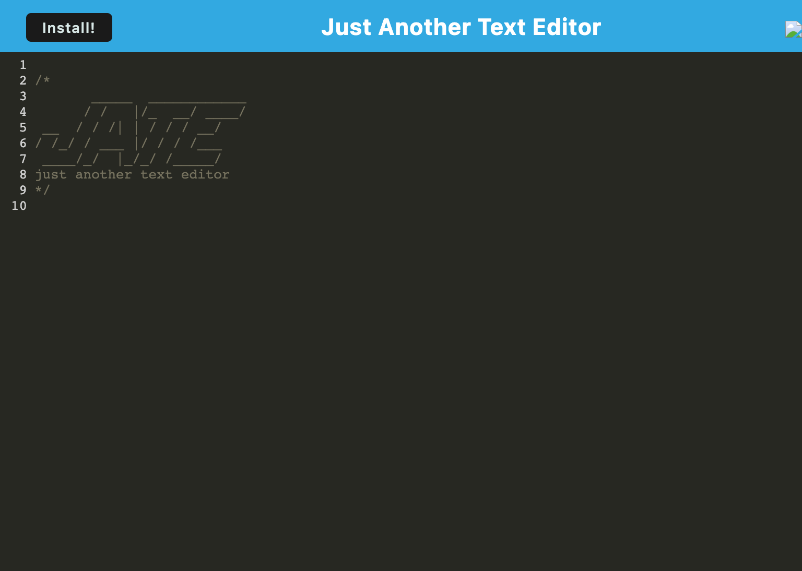
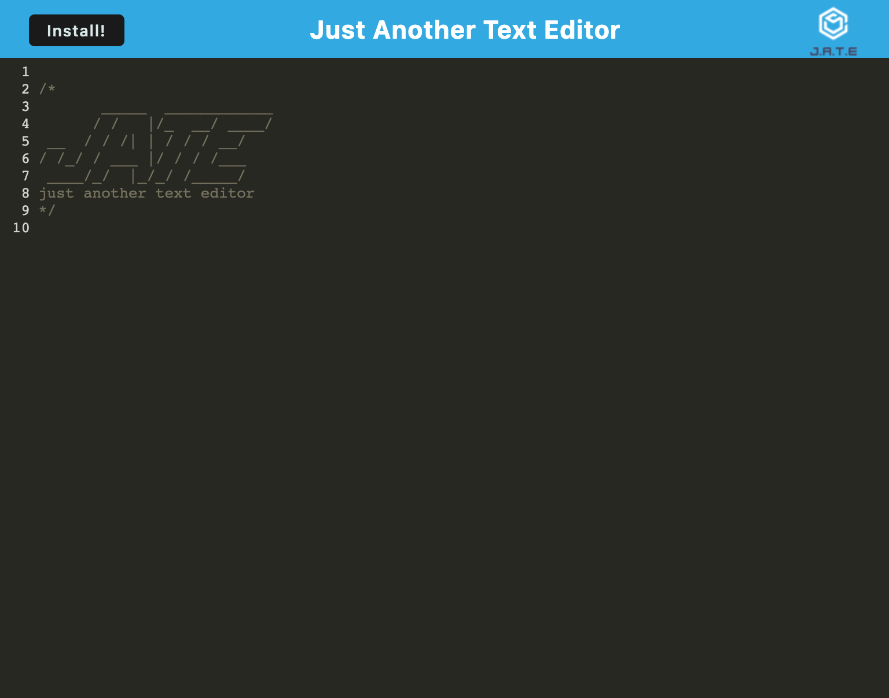
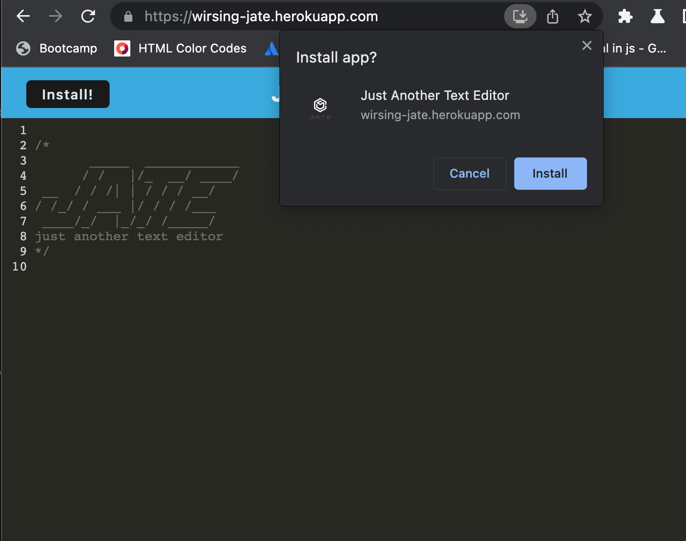
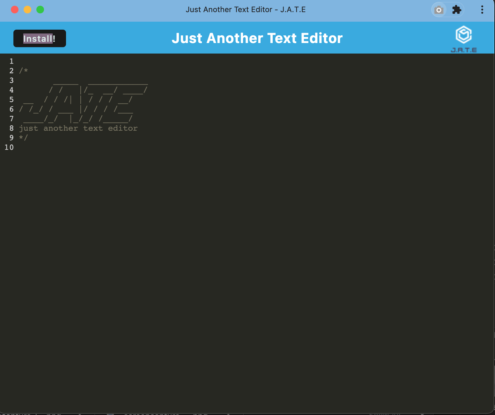
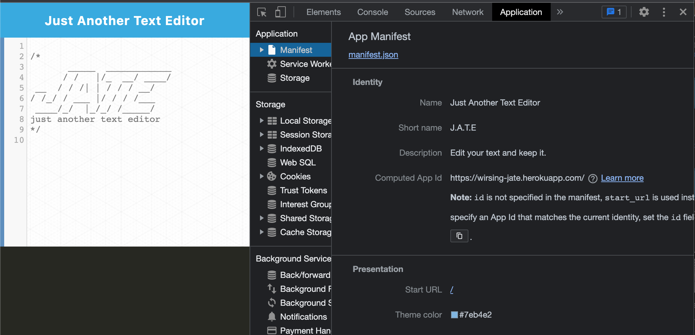
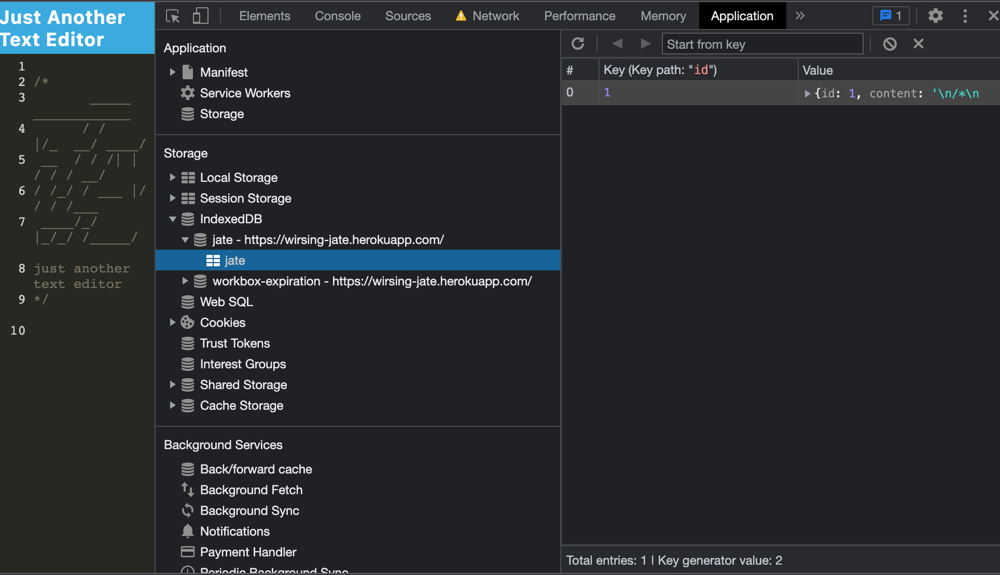

# Module 19 Challenge: PWA Just Another Text Editor (J.A.T.E.) 

##  Description:

This is a simple single-page text editor that runs in a browser and saves text typed in (after a period of time) in the localStorage and indexedDb. The localStorage and indexedDb serves as some data storage redundancy in case one of the options are not supported by the user's browser. The application can be installed locally, can work online and also deployed in Heroku.

The deployed website is:

https://wirsing-jate.herokuapp.com/

##  Table of Contents 
1. [Installation](#installation)
2. [Usage and Features](#usage-and-features)  
3. [Screenshots](#screenshots)
4. [Contributing](#contributing) 
5. [Test](#test) 
6. [Questions](#questions)
7. [License](#license)

## Installation 

LOCAL:
1. Download files in local folder and unzip.
2. Open folder in terminal.
3. Use `npm i` to install the modules needed for the project.
4. Type `npm run start` to build and run the app.
5. Open browser and navigate url to `http://localhost:3000/`.

HEROKU
1. Navigate to https://wirsing-jate.herokuapp.com/

## Usage and Features

This app can be deployed locally or accessed online.

Allows user to create notes or code snippets with or without internet connection.

Technologies used are: JS, CSS, HTML, Webpack with service worker/manifest, localStorage, IndexedDB, Node, Express, Babel, CSS-loader, HTML-webpack plugin, code-mirror and many others.

## Screenshots

Locally deployed app:

HEROKU deployed app:

Install prompt:

Locally installed app:

Manifest:

Service Worker:

IndexedDB

## Contributing 

Ask the author and use according to the MIT license.

## Test 

The following are ways to test the app:
1. Type in text and wait some time before refreshing.
2. Refresh and the text should be reloaded.
3. Inspect the localStorage and IndexedDb.
4. Install the app and test it.
5. Disconnect app from network and test it.
 
## Questions? 

Please contact me through any of the following:

1. My [Github](https://github.com/iwirsing).
2. Email: <a href="mailto:ivymolina@gmail.com">ivymolina@gmail.com</a>

## License
    
The project in covered under the [MIT](https://opensource.org/licenses/MIT) license

